# 数据库概论实习：论坛

## 1 系统总设计
### 1.1 系统目标
* 登录界面提示输入用户名和密码。按“确定”按钮时即进行用户名和密码的验证。同时验证类型（即数据库管理员、版主和普通用户），根据不同的类型进入不同的界
面。提供注册功能，通过注册可以增加普通用户。
* 支持版块展示页面。可展示具体版块内所有帖子及相关信息。
支持用户展示页面。展示该用户的基本信息及发帖、回帖信息。
* 支持用户操作页面。如发帖、回复、查询其他用户信息等。
* 支持搜索页面。可以实现以下操作：
    * 找出在版块A发帖比在版块B中发帖多的所有用户。
    * 分别找出全站点击数与回复数前10的帖子。
    * 按照版块查找在此版块发过贴的用户及其基本信息（性别、年龄等），并分别按照用户的发帖总数和回帖总数排序。
    * 找出每个版块中热度最高的帖子（最后回复时间-发帖时间），并列出所有回复了该贴的用户昵称。
* 对于每个版块，先找出点击数大于平均点击数的帖子，再找出在该版块中回复数大于平均回复数的用户。
* 支持管理员页面。管理员可以删除或增加用户，可以对帖子进行删除、修改等基本操作。
* 支持版主页面。版主可以修改版块信息，可以对用户在该板块发帖和回帖内容进行删除操作。
* 支持触发器监测用户的发帖数量，当该用户在10分钟内发帖数量超过10，便提示管理员该用户行为异常，提示检测其是否为水帖用户。

### 1.2 系统开发环境和平台体系结构选择
#### 1.2.1 前端
* 前端部分，采用了当前比较流行的Vue前端框架，它使用了Virtual DOM，从而能够很容易地进行动态渲染，十分适合构建较为轻量的单页面应用，适合小组作业使用。
* 界面部分，使用了由饿了么开发的一个专门提供各种UI界面的基于Vue的element-UI库。这个项目在github上有3W+的star，被广泛用于各种UI界面的设计。详细的中文官方文档也为开发提供了很多便利。另外和Vue的适配做得很好，可以很轻松地使用npm进行安装。
* 和后台通信方面，使用的是Vue-resource中的原生POST请求。这里的请求是异步的，所以能够一定程度上增加流畅性。
* 整体项目结构是基于Vue提供的脚手架工具Vue-cli来搭建的。

#### 1.2.2 后端
* 后端部分，采用了Apache+PHP的系统架构，由于需要在Windows上进行开发，所以采用了PHPstudy进行环境配置。
* 数据库采用MySQL数据库。

## 2 数据库概念设计
### 2.1 ER模型
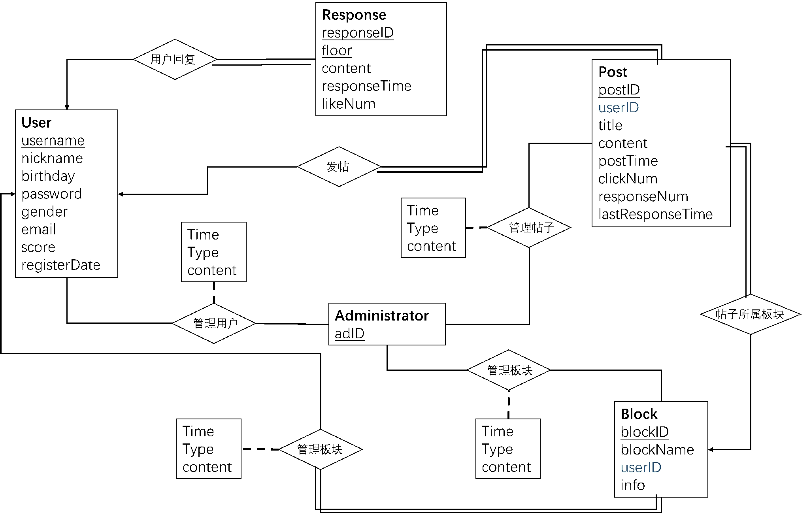
* 粗体为实体名称，包括用户，帖子，回帖，板块，管理员
* 下划线为实体的主码，分别为用户ID，帖子ID，回复ID和楼层，板块ID，管理员ID（管理员ID不同于用户ID）
* 约束条件：蓝色的属性为外码约束，帖子实体中包括发帖人（用户的外码），板块实体中包括版主（用户的外码）。

### 2.2 关系模式表
user (username, nickname, birthday, password, gender, email, score, registerDate)  
post (postID, userID, blockID, title, content, postTime, clickNum, responseNum, lastResponseTime)  
response (responseID, floor, userID, responseContent, responseTime, likeNum)  
admin (adID)  
block (blockID, blockName, userID, info)  
ownerPrivilege (userID, blockID, ownerChangeTime, changeType, changeContent)  
adminUser (adID, adminUserTime, changeType, changeUserID)  
adminPost (postID, adminPostTime, changeType, changePostID)  
adminBlock (blockID, adminBlockTime, changeType, changeBlockID)  
*(其中下划线为主码)*

## 3 实例数据生成
* 利用python生成必要的数据，包括用户、帖子和回帖。
* 注册四个版主，每个版主的权限为板块ID。
* 普通用户为Robot0-Robot59，每个用户有1970年至2010年以内的生日、随机长度和随机命名的邮箱、2018年12月以后的注册时间、随机密码和随机性别，初始积分均为0，初始权限为NORMAL。
* 帖子包括顺序帖子ID、随机板块ID、随机发帖时间、由主谓宾序列生成的标题和内容、6-9个回帖数和随机点击数。
* 回帖包括顺序回帖ID、对应帖子的ID、发帖人昵称、对应楼层、回帖时间、随机内容和随机点赞数。
* 回帖数据满足回帖时间大于帖子发布时间，特定帖子的回帖数和数据库中对应的回帖个数相同、回帖时间随楼层不断增加。


## 4 系统设计与实现
### 4.1前台设计
整个前台是一个单页面应用。通过各种事件响应实现动态渲染。使用Vue内置的路由API实现各个组件之间的导航。

**具体说明：**
* App.vue：作为根节点，保存了所有的全局信息，包括当前用户状态等。以及实现了所有对于子组件产生的事件的响应函数。
* main.js：进行一些基本配置配置，主要是设置路由器的路径，声明需要引用的外部组件和包，以及创建新的根节点组件实例，也是整个程序的入口。

**每个组件的具体功能：**
* create：创建新的用户
* deleteUsr：删除用户。任命新的版主
* header：单页面应用的顶栏，包括用户状态的显示。
* index：进行版面导航的主体部分。
* login：登录界面。
* people：浏览用户的个人信息
* post：浏览某个特定的帖子
* query：包含了所有的查询功能，包括最热门帖子，最活跃用户等功能。
* scanBlock：浏览某一个版面上的所有帖子。

**整体结构：**
* main.js作为整个程序的入口，负责所有的初始化任务，之后将控制权转移到由它创建的App组件。
* 接下来，App组件完成剩下的所有子组件的创建以及组织子组件之间的相互通信。
* 一般而言，子组件中某个按钮按下会触发一个事件，统一由App组件进行接收并响应。
* 响应内容包括
    * 和后台之间进行http请求的发送与接收
    * 处理原始回复
    * 更新全局信息，
    * 动态生成呈献给用户的内容
* 之后根组件会根据具体功能决定是否跳转到新的子组件，这里可以直接使用路由器提供的API来实现方便的跳转。之后等待用户进行新的交互之后触发新的事件，重复上述循环。
以上就是整个前台的工作流程。

### 4.2 后台设计
后台网页根目录为PHPstudy/PHPTutorial/WWW/forum，在此目录下有config.php和com_fun.php两个文件用户设置常量和定义常用函数（如链接数据库函数等），此目录下还有find、manager、post、user四个目录来完成查找、管理员管理、帖子查询回复、用户信息这四方面的功能，每个目录下的一个php文件对应一个接口。  

数据库设计遵循之前描述的关系模式，分为block、post、response、user四个表，表内元组在此不在赘述。

数据库中添加了一个触发器，描述如下：
```SQL
CREATE TRIGGER `Iswater` AFTER INSERT ON `post`  
FOR EACH ROW UPDATE user SET identity = "WATER" WHERE identity = "NORMAL" AND new.postername = username AND (SELECT count(postID) FROM post WHERE username = new.postername AND  DATE_FORMAT(postTime, '%Y-%m-%d-%H') = DATE_FORMAT(NOW(), '%Y-%m-%d-%H') AND MINUTE(postTime)-MINUTE(NOW())<10) > 10
```
*(用于检测10分钟内发帖数大于10的普通用户，并把它们的identity标记为WATER，管理员可以用过调用manager/alluser接口查看所有用户的identity，并以此判断用户是否有“水贴”行为。)*

## 5 用户使用文档
### 5.1 首页登陆
* 左侧可以选择用户注册和登陆：
    * 如果登陆成功，可以进入论坛，看到主页上的帖子。
    * 如果不登陆，无法看到论坛内容。
    * 注册时需要设置账号、密码、昵称、性别、生日和邮箱。
* 右上角显示当前用户名，如果没登陆则显示null。
* 点击右上角退出按钮即可退出论坛。
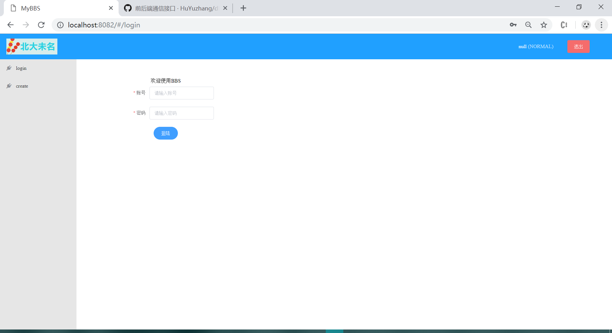
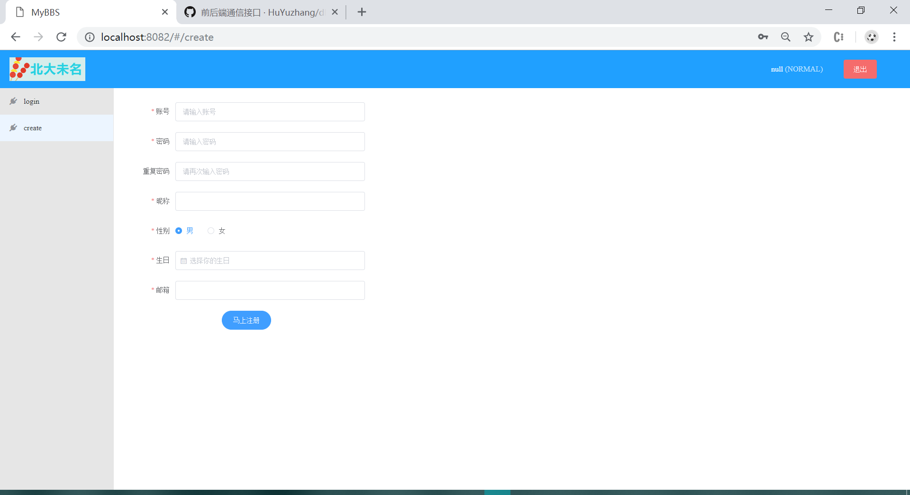

### 5.2 主页Index
* 在主页上显示了4个论坛版块，分别为电影、新闻、鹊桥和求助，可以看到下方的版面信息，点击进入不同板块。
* 如果用户拥有版主权限，则可以看到修改信息的功能按钮，在文本框中输入新的版面信息即可修改。
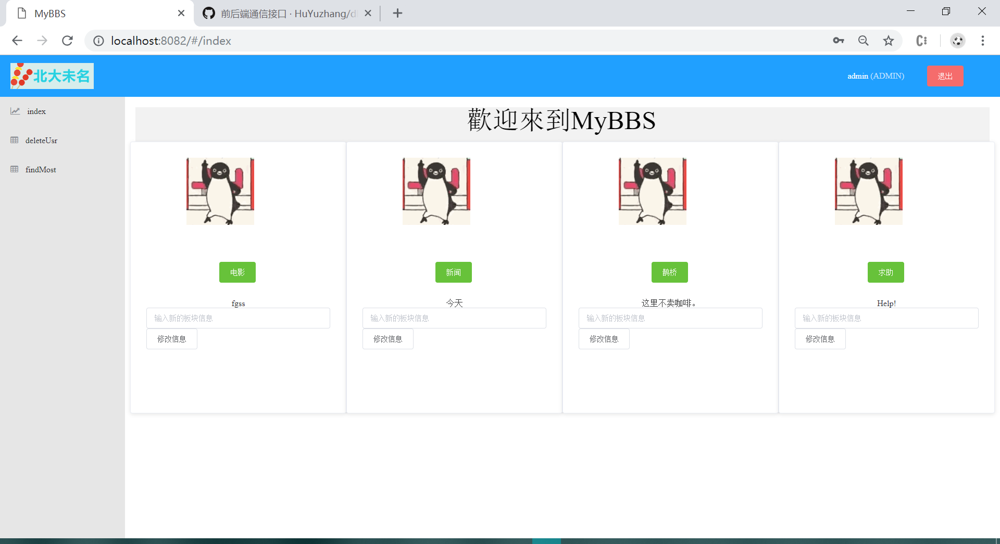


### 5.3 板块页
* 进入板块后可以看到板块内的帖子标题，按照时间顺序排列帖子信息，点击进入帖子回复界面。
* 板块最上方有跳转页面功能，输入要跳转的页面变化，点击“jump”按钮跳转。
* 板块最下方有发帖功能，在第一个框内输入发帖题目，在第二个框内输入发帖内容，点击“发帖”按钮发帖。
* 如果拥有版主或管理员权限，可以看到“删除帖子”按钮，点击删除帖子。
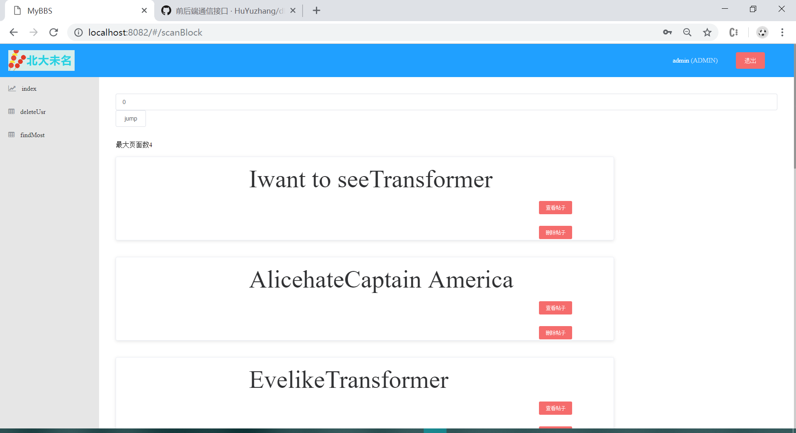

### 5.4 回帖页
* 进入帖子页面后显示帖子的回复数和点击数。
* 回帖页最上方有跳转页面功能，输入要跳转的页面变化，点击“jump”按钮跳转。
* 按照时间顺序排列回帖信息，左侧是回帖人的昵称、回帖时间和回复楼层，右侧是回帖内容和点赞数。
* 点击回帖人下方的“个人主页”按钮可以看到回帖人的个人信息。
* 点击右侧“点赞”按钮可以给回帖点赞。
* 回帖页最下方有回帖功能，在文本框内输入回帖内容，点击“回帖”按钮回帖。
* 如果拥有版主或管理员权限，可以看到“删除回帖”按钮，点击删除回帖。


### 5.5 管理员系统deleteUsr
* 如果拥有管理员权限，可以看到最左侧的deleteUsr分页，点击进入管理员系统。
* 在页面中可以看到所有用户及身份权限，数字为版面ID，NORMAL为普通用户。
* 点击“删除用户”按钮可以删除用户。
* 在导航栏选择版面，再点击“任命版主”按钮即可把该用户任命为该版面版主。
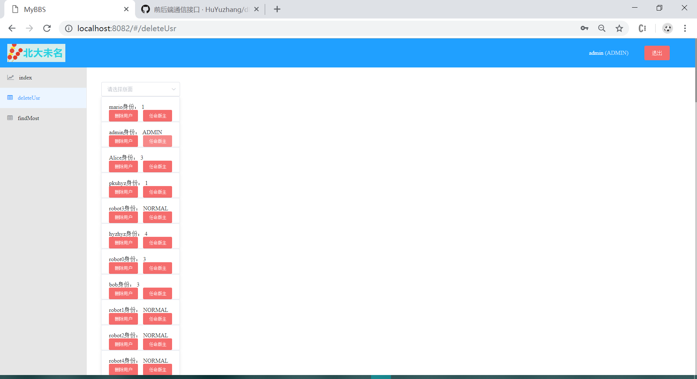

### 5.6 搜索页面findMost
* 点击最左侧findMost进入拥有多重搜索功能的界面。
* 点击“最多点击”按钮，可以看到全站点击数最多的帖子。
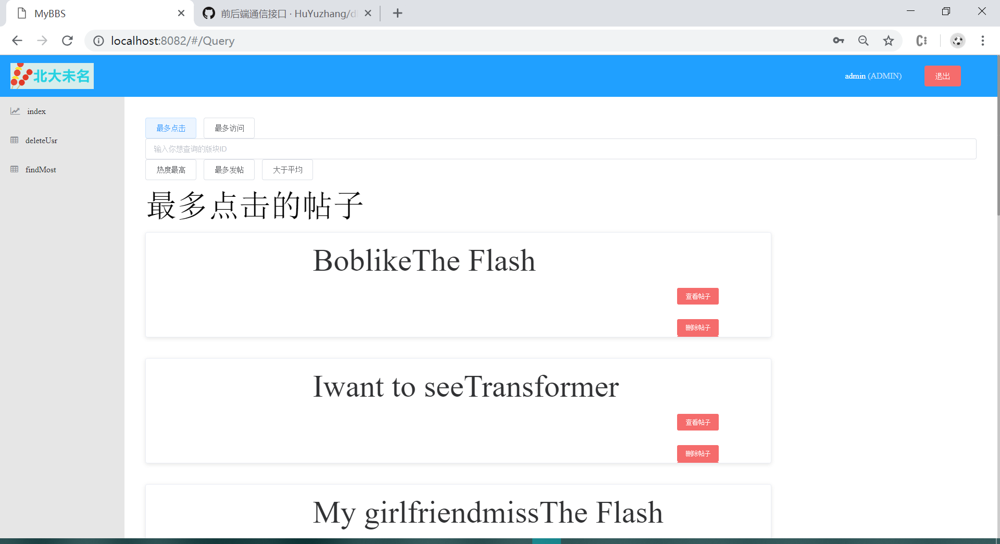
* 点击“最多访问”按钮，可以看到全站回复数前10的帖子。
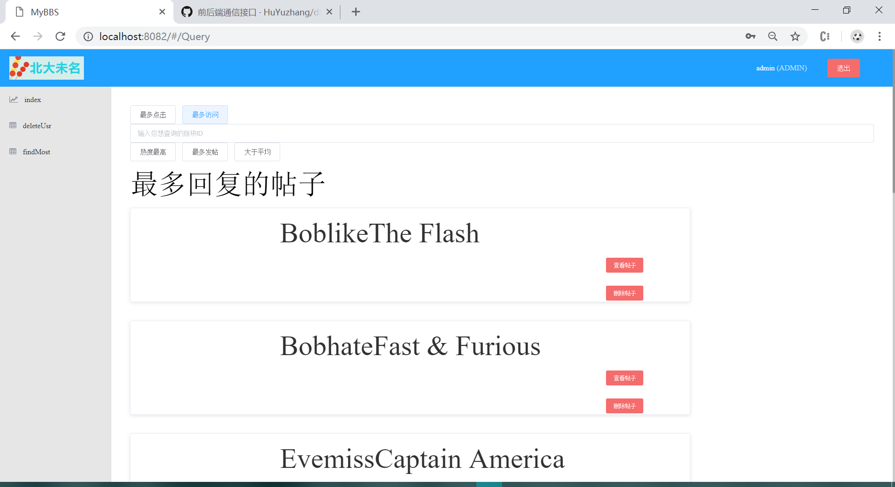
* 点击“热度最高”按钮并在文本框中输入想查询的板块ID，可以看到每个板块中热度最高的帖子（最后回复时间-发帖时间）。
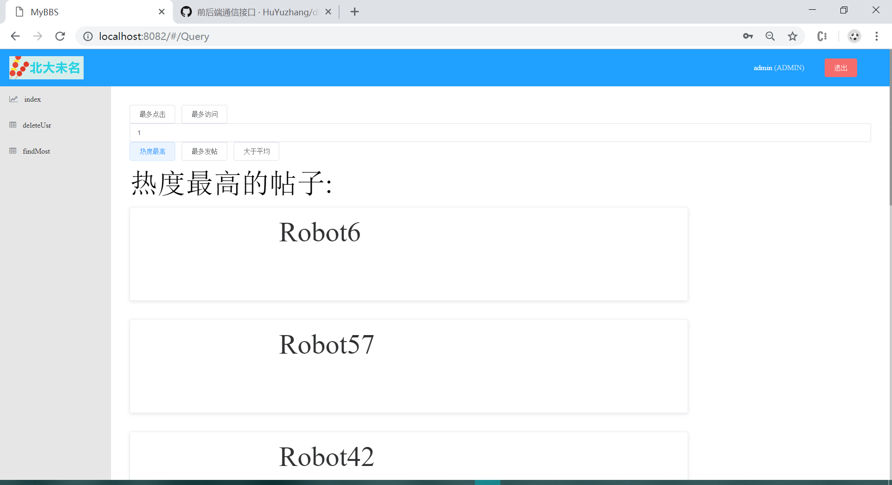
* 点击”最多发帖“按钮，可以看到最活跃用户。
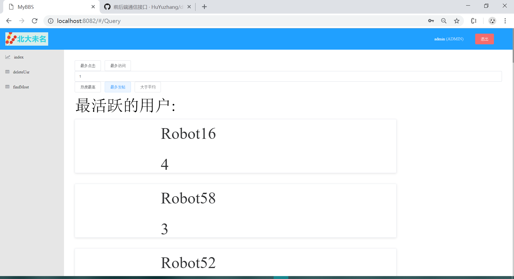
* 点击“大于平均“按钮在文本框中输入想查询的板块ID，可以看到该版块中回复数大于平均回复数的用户。
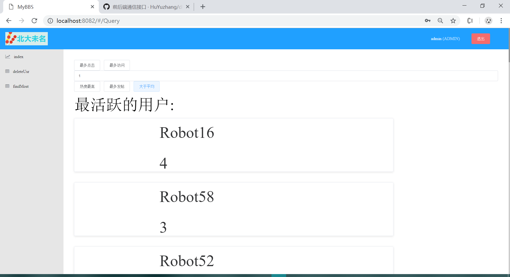

## 附录1（前后端接口）
```javascript
1.	1. 注册：  
2.	/user/signup.php  
3.	{  
4.	‘username’:   
5.	‘nickname’:  
6.	’password’：  
7.	‘birthday’: 20181204 // 生日这里，传过来的可能是不符合格式的，请自行解析  
8.	‘gender’: male/female  
9.	‘email’:  
10.	}  
11.	返回：  
12.	{  
13.	‘statusCode’: 0 成功 1 用户名已存在 2 邮箱已被绑定  
14.	}  
15.	2.登录  
16.	user/signin.php  
17.	{  
18.	‘username’:  
19.	‘password’:  
20.	}  
21.	返回：  
22.	{  
23.	ststusCode: 0 成功 1 用户不存在 2 密码错误  
24.	nickname:  
25.	identity: ‘ADMIN’ ‘NORMAL’ blockname // 对应于管理员，普通用户，blockname版版主  
26.	}  
27.	/post/index.php（新加入的接口，用于初始情况下的所有版面的信息的获取）  
28.	{  
29.	}  
30.	返回：  
31.	{  
32.	result:[{name,blockID,info},{},….]  
33.	}  
34.	3.查询版面  
35.	post/findblock.php  
36.	{  
37.	blockID  
38.	page:  
39.	}  
40.	返回：  
41.	{  
42.	statusCode: 0 成功 1 版面不存在 3.已到队尾  
43.	maxpage:  
44.	result : [{title,postID},{ title,postID}….]  
45.	}  
46.	4.查看帖子：  
47.	post/findpost.php  
48.	{  
49.	‘postID’:  
50.	page: //这个主要是方便你做翻页。一开始为0就好  
51.	}  
52.	返回：  
53.	{  
54.	statusCode: 0 成功 1 帖子不存在 3.已到队尾  
55.	blockID:  
56.	username:  
57.	title:  
58.	maxpage:  
59.	content:  
60.	time: 2018-12-25-23:54:32  
61.	clickNum:  
62.	responseNum:  
63.	LastResponse:  
64.	responseList:[{floor,username,content,time,likeNum},{}….]  
65.	}  
66.	5.发帖：  
67.	post/pushpost.php  
68.	{  
69.	username:  
70.	blockID:  
71.	title:  
72.	content:  
73.	}  
74.	返回：  
75.	{  
76.	statusCode: 0 成功  
77.	postID:  
78.	}  
79.	6.发回复：  
80.	post/pushresponse.php  
81.	{  
82.	postID:  
83.	username:  
84.	content:  
85.	}  
86.	返回：  
87.	{  
88.	statusCode: 0 成功  
89.	page: //所处页面，方便你刷新看到自己的回复  
90.	}  
91.	8.点赞：  
92.	post/like.php:  
93.	{  
94.	postID:  
95.	floor:  
96.	}  
97.	返回：  
98.	{  
99.	statusCode: 0 成功  
100.	likeNum:  
101.	}  
102.	9.看个人主页：  
103.	user/homepage.php  
104.	{  
105.	username:  
106.	}  
107.	返回：  
108.	{  
109.	nickname:  
110.	birthday:  
111.	gender:  
112.	email:  
113.	score:  
114.	signdate:注册日期  
115.	}  
116.	10.管理员删除用户//userID是管理员的账号,targetID是待删除的用户的ID  
117.	manager/deleteuser.php  
118.	{  
119.	username:  
120.	targetname:  
121.	}  
122.	返回：  
123.	{  
124.	statusCode: 0 成功 1权限不足 2 目标用户不存在  
125.	}  
126.	12.管理员删除帖子  
127.	manager/deletepost.php  
128.	{  
129.	username:  
130.	postID:  
131.	}  
132.	返回：  
133.	{  
134.	statusCode: 0 成功 1 权限不足 2 目标帖子不存在  
135.	}  
136.	13.管理员版主管理  
137.	manager/newblocker.php  
138.	{  
139.	blockID:  
140.	username:  
141.	targetname：  
142.	}  
143.	返回：  
144.	{  
145.	statusCode: 0 成功 1 权限不足 2 目标用户不存在 3 目标版面不存在  
146.	}  
147.	14. 管理员/版主修改info  
148.	manager/changeinfo  
149.	{  
150.	blockID:  
151.	username:  
152.	info:  
153.	}  
154.	返回：  
155.	{  
156.	statusCode: 0 成功 1 权限不足  
157.	}  
158.	16. 管理员查看用户列表：//删去了原有需要的版块号信息  
159.	manager/alluser.php  
160.	{  
161.	username:  
162.	page:  
163.	}  
164.	返回：  
165.	{  
166.	statusCode: 0 成功 1 权限不足 2 已到队列尾  
167.	maxpage:  
168.	userlist:[{name,identity},{}….]  
169.	}  
170.	17. 全站点击数前十：  
171.	find/findtopclickpost.php  
172.	{  
173.	}  
174.	返回：  
175.	{  
176.	statusCode:0 成功 1 失败  
177.	result:[{title,postID,blockID},{}]  
178.	}  
179.	18. 全站回复数前十：  
180.	find/findtopresponsepost.php  
181.	{  
182.	}  
183.	返回：  
184.	{  
185.	statusCode:0 成功 1 失败  
186.	result:[{title,postID,blockID},{}]  
187.	}  
188.	19. 找出板块热度最高的帖子，并返回此贴回复用户的昵称  
189.	find/findhotestpost.php  
190.	{  
191.	blockID:  
192.	}  
193.	返回：  
194.	{  
195.	statusCode: 0 成功 1 失败  
196.	postID:  
197.	result:[{postername},{},{}]  
198.	}  
199.	20.找出板块发帖的用户的信息，以发帖总数排序：  
200.	find/finduser.php  
201.	{  
202.	blockID:  
203.	}  
204.	返回：{  
205.	statusCode: 0 成功 1 失败  
206.	userlist:[{username,posttime},{},{}]  
207.	}  
208.	21.找出板块点击数大于平均点击数的帖子  
209.	{  
210.	blockID：  
211.	}  
212.	返回：{  
213.	statusCode：  
214.	result:[{postID},{}]  
215.	} 

```